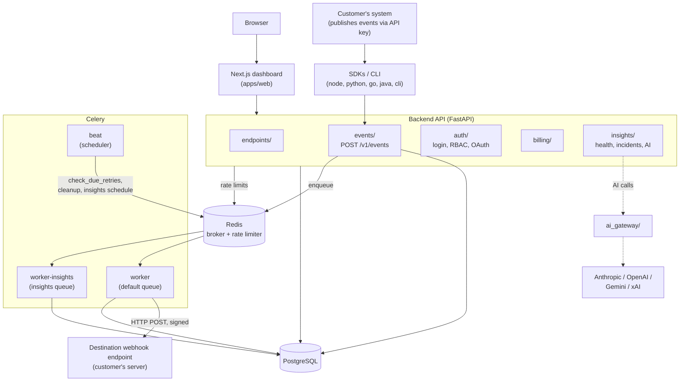
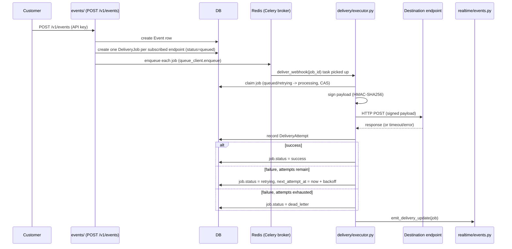
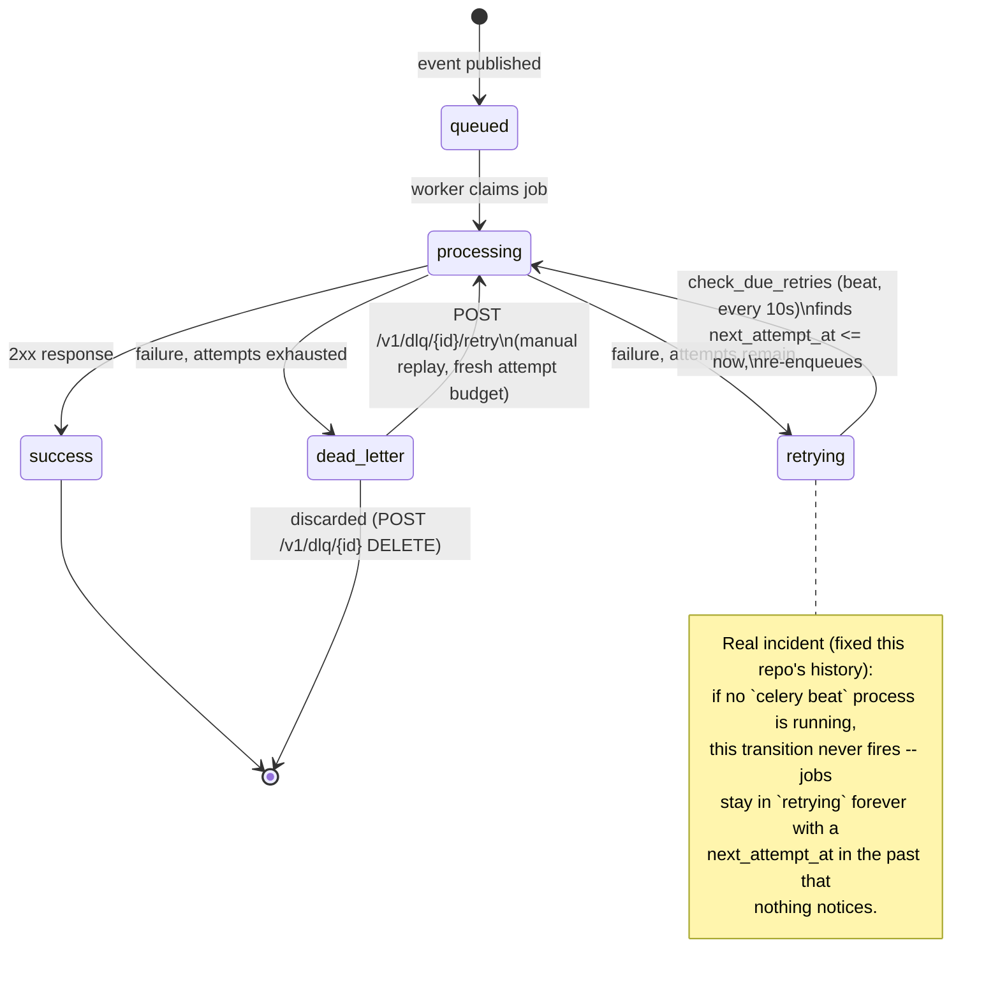
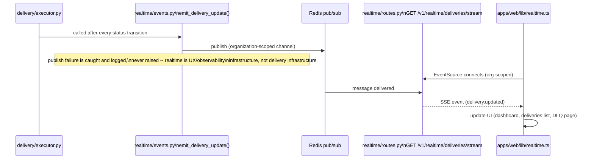
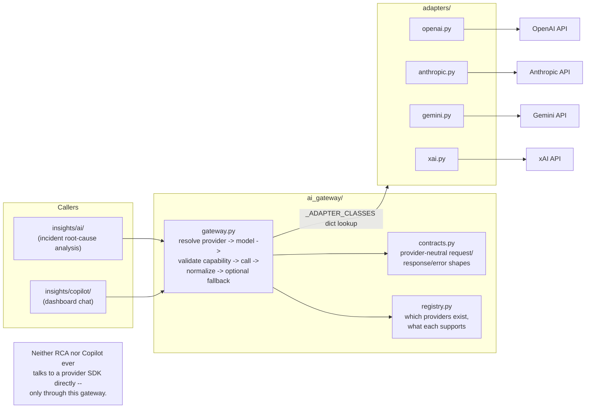
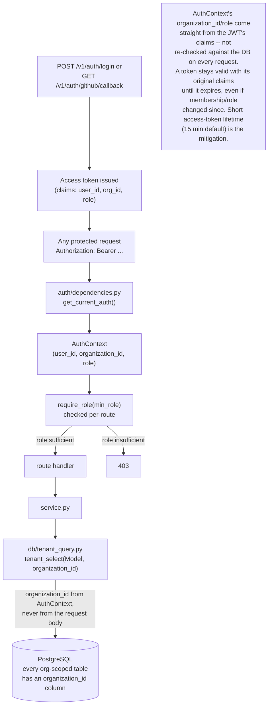

# Architecture Diagrams

Companion to [`README.md`](README.md) in this directory — that file is the
authoritative implemented-vs-planned text description; these diagrams
visualize the same real system. If a diagram and the text ever disagree,
the text file and the actual code win; open an issue.

## 1. High-level system

## 2. Webhook delivery lifecycle

## 3. Retry / DLQ lifecycle

## 4. Realtime delivery status lifecycle

## 5. AI Gateway architecture

## 6. Authentication / multi-tenancy flow

